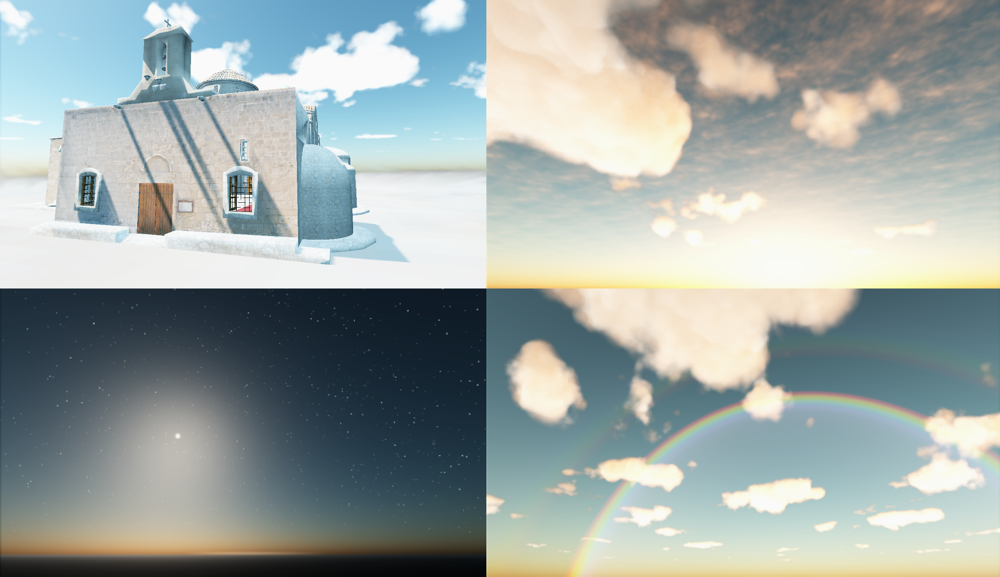

# SevenSky
Physically based sky rendering library



## Example file

Check out [TestSky file to start.](https://github.com/TehLeo/SevenSky/blob/master/test/test/theleo/sevensky/TestSky.java)

## License

The library is located in src folder, licences under BSD 3-Clause.

Additional libraries which can be optionally used are located in:
* src-hyg HYG Star catalogue (https://github.com/astronexus/HYG-Database)

* src-nuta Nutation Function (SOFA Software License), use if you are interested in the accurate calculation of celestial bodies based on time and location of observer.
  To use the nutation function use
  ```
  Space.NutationFunction = new NutationFunction();
  ```
* src-vsop Location of Planets in the Solar system (GNU Affero General Public License, version 3)
   ```
   Space.EarthPosition = new Earth();
   //eg:
   Space.getEarthPos(jullianDate, observerLon, observerLan);
   //or
   Space.EarthPosition.getLon(jullianDate);
   ```
